# Osborne 1 PicoRC Installation: Early Version (Side Latch)

[Purchase Link](https://www.tindie.com/products/30087/) | [Official Discord](https://discord.gg/HAuuh3pAmB) | [Main Page](osborne1.md)

## Kit Assembly

[See Main Article](osborne1.md)

## Installation

* 🚨🚨 This guide is for **EARLY MODEL (SIDE LATCH)**, [CLICK ME FOR LATE MODEL (TOP LATCH)](osborne1.md) 🚨🚨

Some disassembly is needed, make sure to **take plenty of photos** along the way! 

Take a photo one before removing a screw or unplugging a connector! It never hurts to have reference.

-------

I'll be using a new-to-me and untested early Osborne 1 for this guide, excuse the dust!

With Apple stickers! 😅

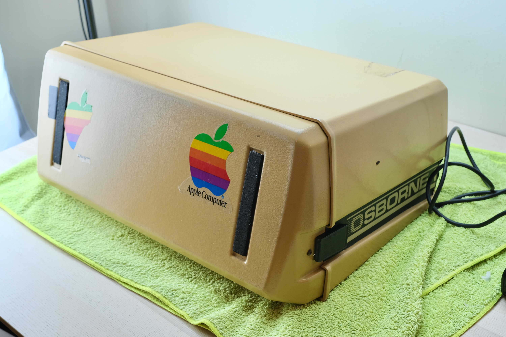

* Put it on a soft towel

* At the back, remove 6 screws on the power panel

* Also two screws on the handle

* Organise your screws! 

* At each stage, put em in a bag with labels to avoid mix-ups.

* Unlatch and unplug the keyboard.

* Remove Brightness and contrast knob, use a small allen key.

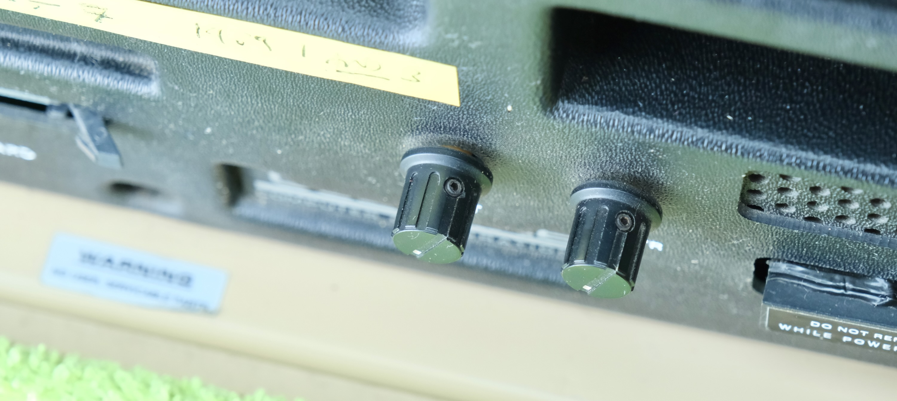

* Undo the 7 face plate screws

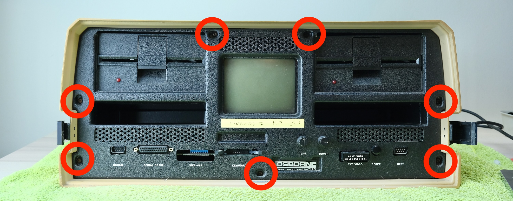

* Remove the face plate

* Remove the two side screws

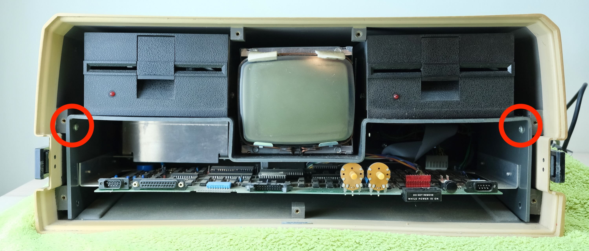

* Take out the entire innards

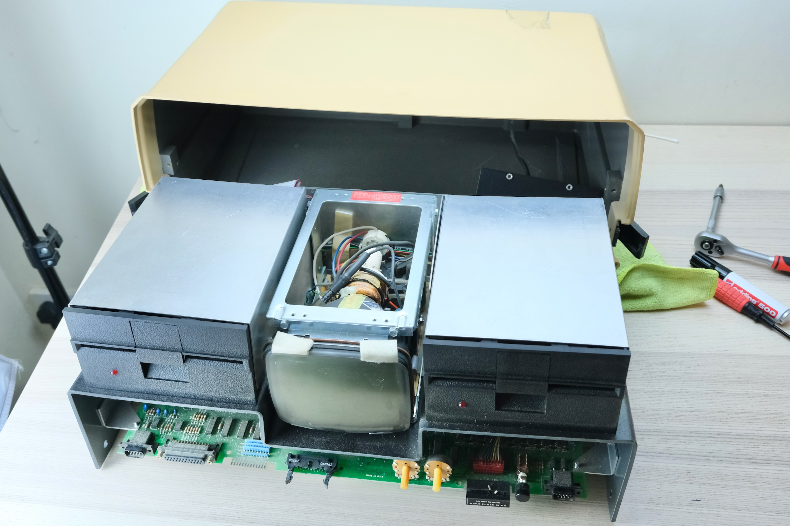

* Flip it over and remove 4 screws holding the motherboard

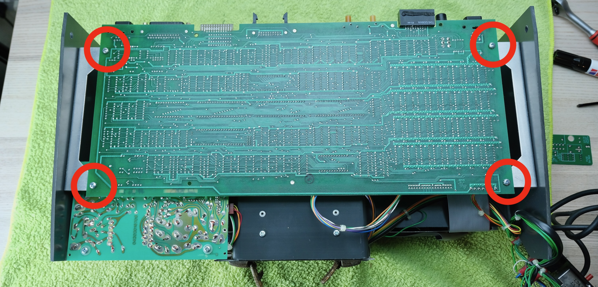

* Rest the motherboard on the table.

* **Take some photos** of all the connectors' orientation!

* Unplug the motherboard if you want, makes things easier.

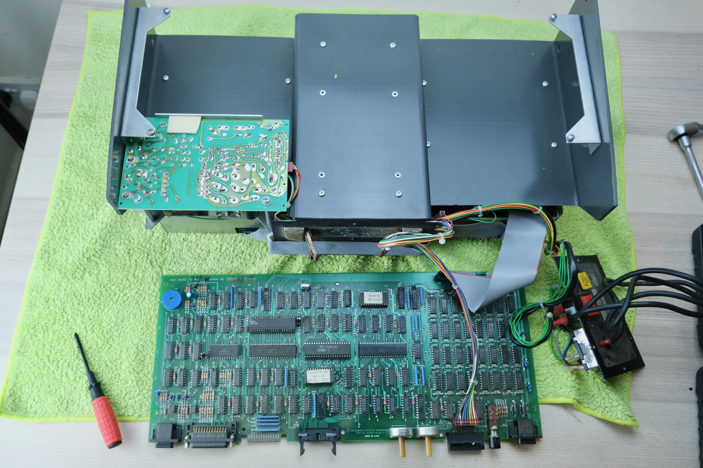

* Undo 4 screws on the old PSU

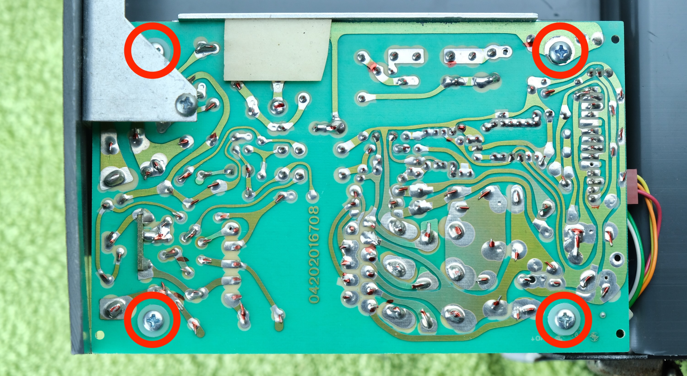

* Unplug all the cables on the old PSU

* Put it away for safekeeping along with all the other removed items. =

* **Don't throw anything away!**

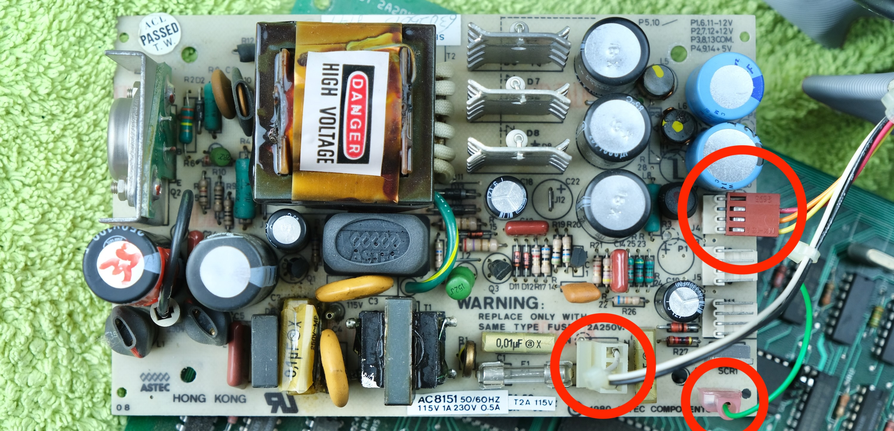

* Undo 4 screw holding the CRT, make sure it doesn't drop on the table.

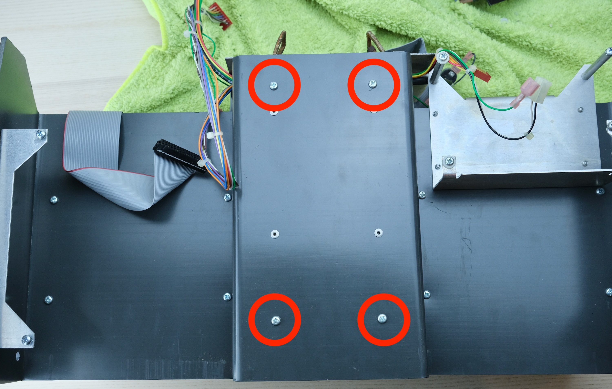

* Flip up the chassis, the CRT should remain in place.

* Take a photo of connector, then unplug the CRT harness.

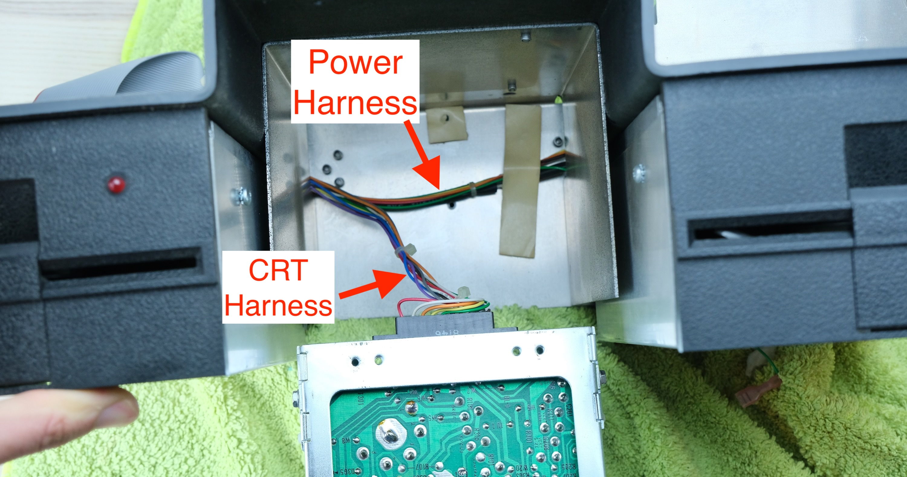

* Now we want to remove the old **power harness**

* It's a bit fiddly, but definitely doable.

* Unstick and unplug thermal fuse

* Also unplug all the green grounding blades on the harness

* Now you should be able to pull it through the CRT opening

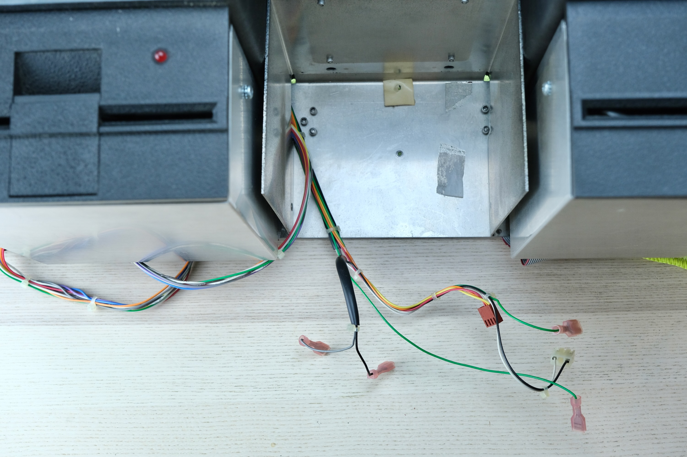

* Also unplug everything on the power panel

* Now you should be able to remove the harness entirely

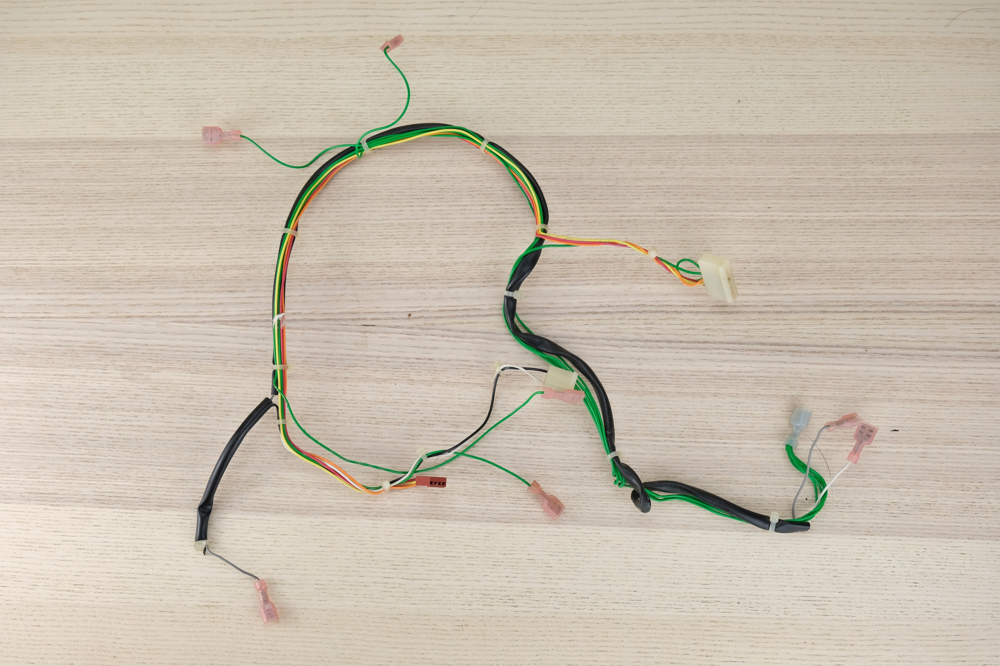

* Pop out the **two green wires** on the power connector by inserting a small flatblade screwdriver on the metal latch and gently pulling outwards

* Cut the zipties on the harness, and separate out the the only part we need.

* Which is the Red/Yellow/Orange motherboard power cable

* At this stage, it might be a good idea to give it a test!

* There should be one (or more) 4-Pin power connectors, with **RED**, **ORANGE**, and **YELLOW** wires. One pin is unpopulated.

* Plug it into the power connector on the adaptor.

* Make sure to **match the colours** shown on the PCB.

* Plug the other end to the motherboard

* Refer to the photo you took earlier

* Also plug in the CRT

* Turn it on and see what happens!

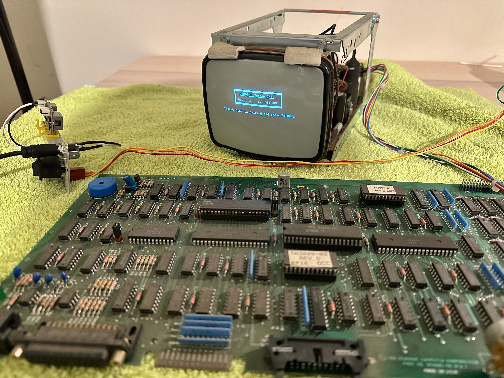

* Mine works! It even says "Osborne System One" instead of simply Osborne 1 like the later BIOS.

* The RAM tends to go bad a lot, so start there if not working.

* At this age, it's a good idea to do a teardown and clean anyway.

* Blow out dust, lube the floppy, check for cracked solder joints on the CRT board, etc.

--------

* Anyway, after you're done, we can start putting it back together!

* Install the adapter and blanking plate in the power panel as shown.

* Insert the screws from **INSIDE**, and tighten the nuts on the outside.

* Bend the cable inwards, insert the barrel jack through the hole and secure with locking ring.

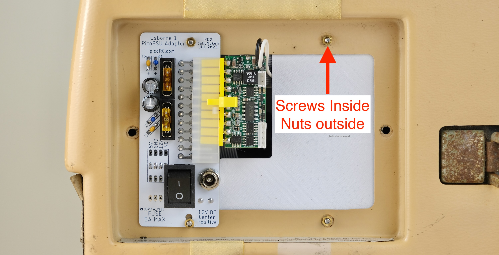

* Hook up the motherboard power cable

* That's pretty much it! Now you just have to put it back together!

* Refer to the photos you took, make sure all connectors are plugged back in in the correct orientation.

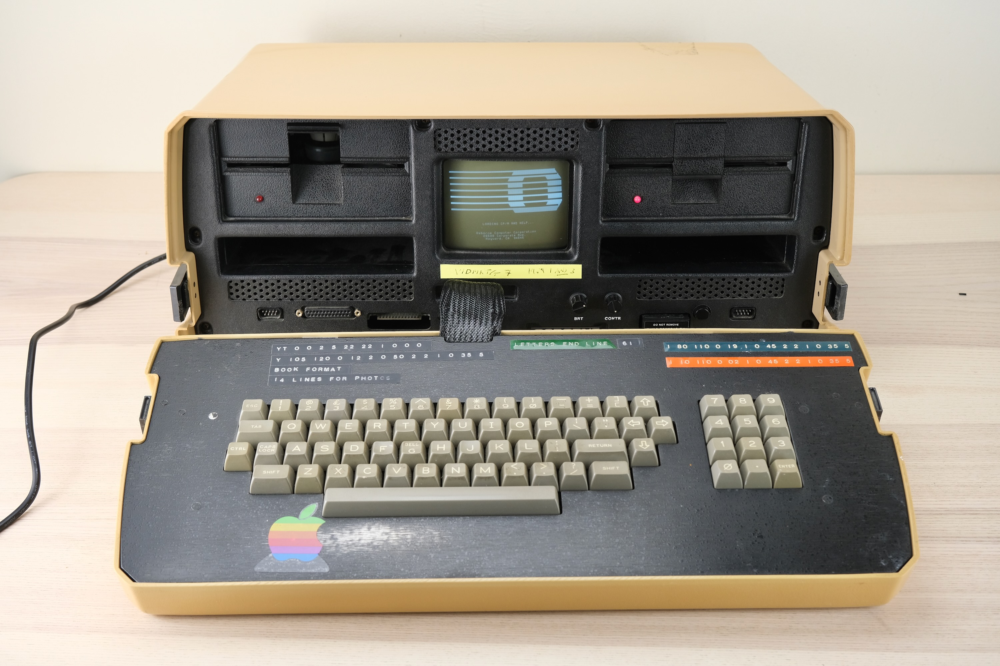

## Questions or Comments?

Feel free to ask in official [Discord Chatroom](https://discord.gg/T9uuFudg7j), raise a [Github issue](https://github.com/dekuNukem/PicoRC/issues), or email `dekunukem` `gmail.com`!
