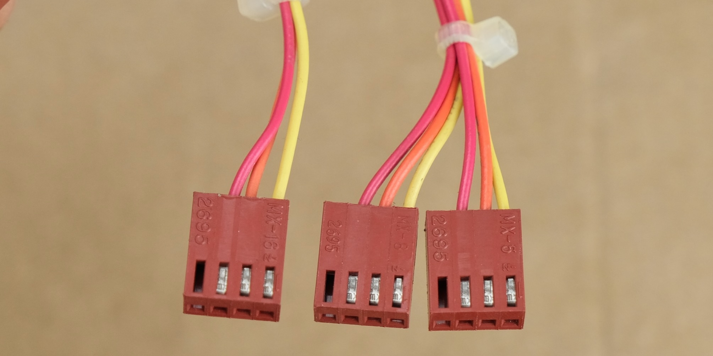

## Installation

* 🚨🚨🚨🚨 This guide is for **EARLY MODEL (SIDE LATCH)**, [CLICK ME FOR LATE MODEL (TOP LATCH)](./osborne1_early.md) 🚨🚨🚨🚨

* 🚨🚨🚨🚨 This guide is for **EARLY MODEL (SIDE LATCH)**, [CLICK ME FOR LATE MODEL (TOP LATCH)](./osborne1_early.md) 🚨🚨🚨🚨

* 🚨🚨🚨🚨 This guide is for **EARLY MODEL (SIDE LATCH)**, [CLICK ME FOR LATE MODEL (TOP LATCH)](./osborne1_early.md) 🚨🚨🚨🚨

* 🚨🚨🚨🚨 This guide is for **EARLY MODEL (SIDE LATCH)**, [CLICK ME FOR LATE MODEL (TOP LATCH)](./osborne1_early.md) 🚨🚨🚨🚨

Some disassembly is needed, make sure to **take plenty of photos** along the way! 

Snap one before removing a screw or unplugging a connector! It never hurts to have reference.

-------

I'm using a new-to-me and untested Early Osborne 1 in this guide.

The adaptor should also work with the early version as well, although you'll need to take the whole innards out.

* Put it on a soft towel, unlatch and unplug the keyboard.

* Remove Brightness and contrast knob.

* Undo the tiny screw at the bottom, if doesn't exist, just pull it off.

* Undo the 6 face plate screws

* Organise your screws! 

* At each stage, put em in a bag with labels to avoid mix-ups.

* Flip it over, undo five screws and remove the back cover

* Turn it around so the back is facing you

* Lift off the handle plate

* Lift off the power panel

* Undo the four screws on the power panel

* On the back, unplug all the cables until the panel can be removed.

* Use a pair of pliers and wiggle side to side

* Once removed, put the screws back on the plate, along with plastic sheet and rubber cap.

* Put it away for safekeeping along with all the other items removed. **Don't throw anything away!**

* Remove four motherboard bracket screws

* Hinge the motherboard toward you and rest it on the table

* Now it's a good time for an inspection

* This one has the "Screen-Pac" and dual-density floppy upgrade, neat!

* Once done, undo the four screws on the PSU. (Two under the plastic sheet)

* Cut the ziptie

* Flip over the PSU, unplug all the cables, and put it away.

* Pop out the thermal fuse and remove the wiring harness

* Put the PSU screws and sheet back on the standoff so you don't lose them.

* With all the extra stuff removed, now it's a good time to see if your Osborne still works.

* There should be two or three 4-Pin power connectors, with **RED**, **ORANGE**, and **YELLOW** wires. One pin is unpopulated.

* Plug them into the power connectors, make sure to **match the colours** shown on the PCB.

* Connect the barrel jack, flip on the switch, and see what happens!

* Amazingly, this one works! I'm surprised! 😅

* The RAM tends to go bad a lot, so start there if not working.

* At this age, it's a good idea to do a teardown and clean anyway.

* Blow out dust, lube the floppy, check for cracked solder joints on the CRT board, etc.

--------

* Anyway, after you're done, we can start putting it back together!

* Install the adaptor as shown in the power panel holder.

* Note the orientation!

* Bend the cable so it goes inwards.

* Use the standoff to secure it from the other side.

* Install the blanking plate on the inside. Secure with screws and standoffs as before.

* Undo the locking ring on the barrel jack, insert through the hole, fasten it on the other side.

* Plug in the power connectors again

---------

**Adding a Fan**

If you want to add a fan, time to do it now.

Any standard PC fan should work.

**Don't mount the fan too close to the CRT**, or the picture might wobble from the motor's magnetic field.

Make sure the fan is secured, nothing touches the blade, and air flow direction is correct.

--------

* Insert the handle and power panel back in the case.

* Note the orientation, and **don't forget the door**!

* Finally, plug in the green grounding strap.

* That's pretty much it! Now you just have to put it back together!

## Congratulations!

With the new PSU, maintenance, and upgraded cooling, hope your Osborne 1 continue to provide exhilarating CP/M entertainment for years to come!

## Questions or Comments?

Feel free to ask in official [Discord Chatroom](https://discord.gg/T9uuFudg7j), raise a [Github issue](https://github.com/dekuNukem/PicoRC/issues), or email `dekunukem` `gmail.com`!
